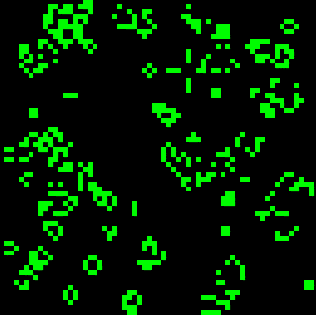

# What is Conway's Game of Life?

Invented by mathematician John Conway, Conway's Game of Life (hereafter, Life for short) is a simulation game - a game that tries to resemble real life processes.

Life simulations take place on an infinite grid, (though due to the limitations of technology, we will use a finite grid)

Each cell (square) in the grid can be in one of two possible states: Alive or Dead. A living state is usually indicated by a colored square; a dead state by a blank square.

Each square is adjacent to eight others. These eight squares surrounding the square in question are referred to as its neighbors.

Every simulation begins with a set of live cells. This is referred to as the initial population. (Technically, you could begin with all cells being dead, but that would make for a dull simulation.)

Then, the pattern evolves according to a certain set of rules. The set of rules determines what happens to each cell from one generation (configuration of live and dead cells) to the next.

# What is NFT?

[wiki] A non-fungible token (NFT) is a unit of data stored on a digital ledger, called a blockchain, that certifies a digital asset to be unique and therefore not interchangeable.[1] NFTs can be used to represent items such as photos, videos, audio, and other types of digital files. Access to any copy of the original file, however, is not restricted to the buyer of the NFT. While copies of these digital items are available for anyone to obtain, NFTs are tracked on blockchains to provide the owner with a proof of ownership that is separate from copyright. 

## Example of NFT as a `gif` file

# NFTs experiment

https://singular.rmrk.app/space/Dg4WdqYHM7CV7KpPMW95iwPXNVfVPmBFKeDsCriVmBc2RDr
